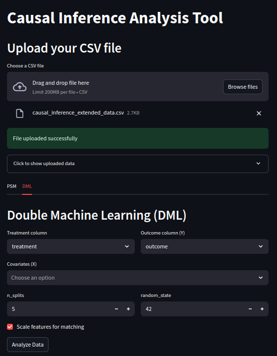
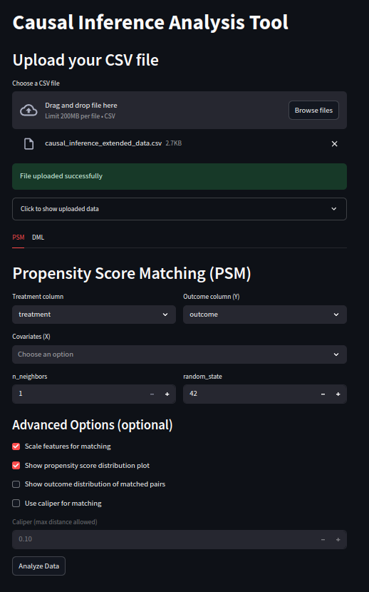

# Causal Inference Analysis Tool

This project provides a web-based tool for performing **Propensity Score Matching (PSM)** and **Double Machine Learning (DML)** on your tabular data. The backend is built with FastAPI, and the frontend uses Streamlit for an interactive user experience.

---

## Demo

### DML Tab



### PSM Tab



*Above: The Streamlit frontend for uploading data and running PSM or DML analysis.*

---

## Features

- **Upload CSV data** and select columns for analysis.
- **Propensity Score Matching (PSM):** Estimate ATT and ATE, visualize propensity and outcome distributions, and inspect matched pairs.
- **Double Machine Learning (DML):** Estimate ATT and ATE using cross-fitting and machine learning models.
- **Interactive visualizations** for results.

---

## Getting Started

### 1. Clone the repository

```bash
git clone <your-repo-url>
cd causal_inference
```

### 2. Install dependencies

```bash
pip install -r requirements.txt
```

### 3. Run the backend (FastAPI)

```bash
uvicorn backend.main:app --reload
```

The API will be available at [http://localhost:8000/api](http://localhost:8000/api).

### 4. Run the frontend (Streamlit)

```bash
streamlit run frontend/app.py
```

The app will open in your browser.

---

## Usage

1. **Upload your CSV file** using the upload widget.
2. **Select the analysis tab** (PSM or DML).
3. **Choose the treatment, outcome, and confounder columns**.
4. **Configure analysis parameters** as needed.
5. **Click "Analyze Data"** to run the analysis and view results.

---

## File Structure

```
backend/
  core/
    psm.py      # PSM logic
    dml.py      # DML logic
  api/
    routes.py   # FastAPI endpoints
    schemas.py  # Pydantic schemas
  main.py       # FastAPI app entrypoint

frontend/
  app.py        # Streamlit frontend

requirements.txt
README.md
```

---

## Requirements

See [`requirements.txt`](requirements.txt) for all dependencies.

---

## License

MIT License

---

## Acknowledgements

- [FastAPI](https://fastapi.tiangolo.com/)
- [Streamlit](https://streamlit.io/)
- [scikit-learn](https://scikit-learn.org/)